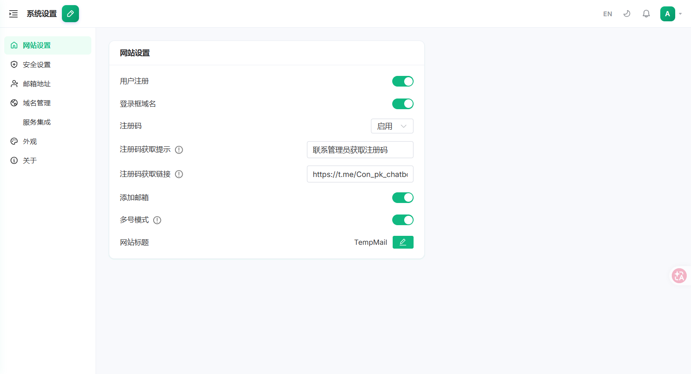
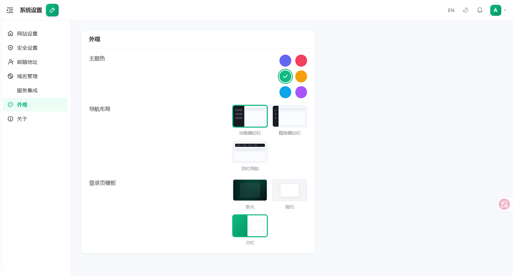
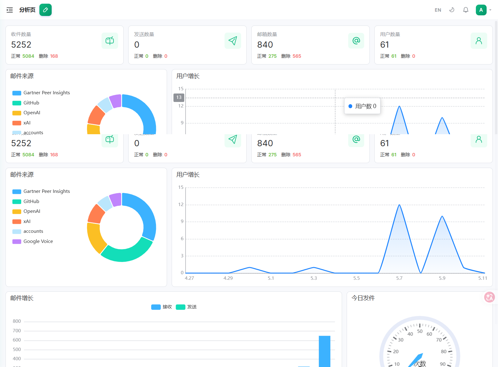
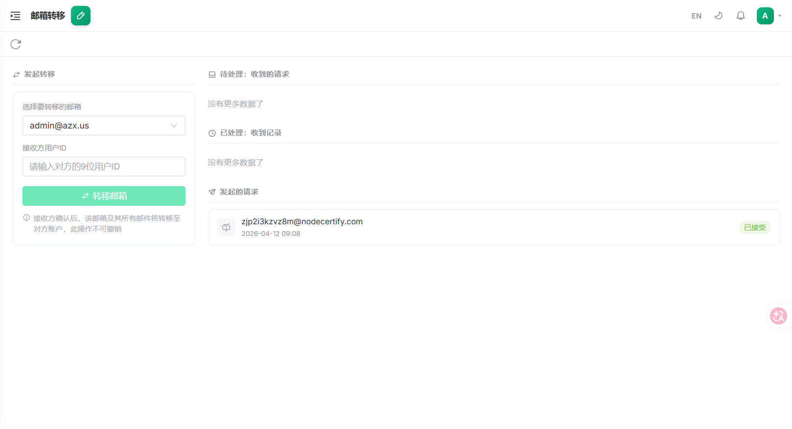

<div align="center">

# Xi-Mail

**基于 Cloudflare 全家桶的自托管临时邮箱服务**

二次开发自 [cloud-mail](https://github.com/eoao/cloud-mail) · UI 全面重设计 · 功能持续扩展

[](LICENSE)
[](https://github.com/PastKing/xi-mail/releases)
[](https://github.com/PastKing/xi-mail/stargazers)
[](https://t.me/pk_oa)

[简体中文](README.md) | [English](README-en.md)

</div>

---

## 📸 界面预览

| 系统设置 | 外观 / 主题 |
|:---:|:---:|
|  |  |
| **数据分析** | **邮箱转移** |
|  |  |

> 更多截图见 [doc/images/](doc/images/)

---

## 🔑 在线体验

> 演示站：[https://mail.azx.us](https://mail.azx.us)

测试账号使用注册码注册，仅限 `@nlfree.me` 后缀，**仅供系统预览，请勿存放真实邮件**：

| 注册码 | 可用域名 | 说明 |
|--------|----------|------|
| `viewUser` | `@nlfree.me` | 普通用户体验账号 |

---

## 📖 项目简介

Xi-Mail 是基于 **Cloudflare Workers / D1 / KV / R2** 构建的全栈自托管邮箱服务，在 [cloud-mail](https://github.com/eoao/cloud-mail) 开源项目基础上进行二次开发，带来全面 UI 重设计与一系列新功能。

只需一个托管于 Cloudflare 的域名，即可免费部署支持多账户、多域名、层级权限的完整邮箱平台。

---

## ✨ 相比上游新增 / 改动

### 🎨 UI 全面重设计（Linear 风格）
- 采用 **TailwindCSS 4** + **@vueuse/motion** 动画库重构前端样式系统
- 登录 / 注册页：3 套模板（极光 / 简约 / 分栏），6 套主题色预设，系统设置可一键切换并持久化
- 登录后布局：完整侧边栏 / 精简侧边栏（仅图标）/ 顶栏导航，三种模式自由切换
- 侧边栏：深色极简风格，图标统一；精简模式宽度收缩至 56px 并显示 Tooltip
- 顶栏：紧凑布局，渐变 Compose 按钮，用户信息面板优化
- 全局设计 Token：indigo-violet 渐变色系、彩色阴影、统一圆角
- **顶栏语言切换按钮**：一键切换中文 / 英文界面，实时生效并持久化保存

### 👤 用户系统增强
- **Display ID**：用户 ID 改为随机字母数字组合（`xxxx-xxxx-xxxx`），不再使用纯数字自增
- Display ID 展示于：用户详情面板、个人设置页、顶栏头像悬浮卡片
- **邮箱转移**：用户可将邮箱账户及其全部邮件转移给其他用户（通过 Display ID 指定），接收方可确认或拒绝

### 📬 账号管理优化
- 收件箱 / 已发送页侧边栏账号列表：新增搜索过滤，显示完整邮件地址，账号上限提升至 100 个
- 账号操作下拉菜单始终可见（含邮箱转移入口）
- **已发送 / 草稿箱**：无发送权限或角色被禁止发送时，侧边栏自动隐藏这两个菜单项
- **邮箱可重建**：已删除的邮箱可重新创建（自动恢复历史数据）

### 🔄 转移功能页（`/transfer`）
- 独立侧边栏页面，支持发起转移、查看待处理 / 已发送转移请求
- **已处理收到记录**：保留所有已接受 / 已拒绝的传入请求历史，不再消失
- 顶栏 Badge 实时显示待处理数量

### 🛡️ 权限系统重设计
- 角色新增 `level` 字段（数值越大权限越高）
- 用户只能为权限等级低于自身的角色生成邀请码
- 邀请码生成时服务端严格校验等级约束

### 🗂️ 批量操作（用户管理）
- 支持批量封禁、批量解封、批量删除选中用户
- 用户关联邮箱账号支持批量删除

### ⚙️ 系统设置增强
- **外观模板系统**：系统设置重构为「左侧导航 + 右侧内容」双栏布局，分 7 个分区（网站 / 安全 / 注册 / 域名 / 服务集成 / 外观 / 关于）
- **域名在线管理**：无需修改 `wrangler.toml`，直接在系统设置中新增、删除、启用 / 禁用邮箱域名，配置完成后 `domain` 变量可留空
- **全局 API Token**：管理员可开启并生成全局 Token，通过 `x-admin-auth` 请求头无需登录直接查询邮件
- **邮件地址关键词黑名单** + **发件人域名黑名单**：防注册敏感词 / 防邮件轰炸
- **注册码提示与获取链接**：启用注册码后可配置提示文字及跳转链接

### 🔎 搜索增强
- **用户管理子账号搜索**：在 `/all-users` 搜索邮箱时，可同时匹配该用户名下创建的所有子账号邮箱

---

## 🛠️ 技术栈

| 层级 | 技术 |
|------|------|
| 运行时 | Cloudflare Workers |
| Web 框架 | Hono |
| ORM | Drizzle ORM |
| 数据库 | Cloudflare D1 (SQLite) |
| 缓存 / 会话 | Cloudflare KV |
| 文件存储 | Cloudflare R2 |
| 前端框架 | Vue 3 + Vite |
| UI 组件库 | Element Plus |
| CSS 工具 | TailwindCSS 4 |
| 动画库 | @vueuse/motion |
| 状态管理 | Pinia |
| 路由 | Vue Router |
| 国际化 | vue-i18n（中文 / 英文）|

---

## 📁 目录结构

```
xi-mail/
├── mail-worker/                 # Cloudflare Worker 后端
│   ├── src/
│   │   ├── api/                 # 接口路由层
│   │   ├── service/             # 业务逻辑层
│   │   ├── entity/              # Drizzle 数据库实体
│   │   ├── security/            # JWT 身份认证 + 权限中间件
│   │   ├── init/                # 数据库初始化 / 版本迁移
│   │   └── index.js             # Worker 入口
│   └── wrangler.example.toml    # 配置模板（复制为 wrangler.toml 后填写）
│
├── mail-view/                   # Vue 3 前端
│   ├── src/
│   │   ├── layout/              # 布局组件（侧边栏 / 顶栏 / 顶栏导航）
│   │   ├── views/               # 页面组件
│   │   │   └── login/templates/ # 登录模板 CSS（gradient / minimal / split）
│   │   ├── themes/              # 主题色 CSS（indigo / rose / emerald / amber / sky / purple）
│   │   ├── store/               # Pinia 状态管理
│   │   ├── i18n/                # 国际化（zh / en）
│   │   └── style.css            # 全局样式 / 设计 Token
│   └── vite.config.js
│
└── doc/images/                  # 截图预览
```

---

## 🚀 快速部署

### 前置要求

- Node.js ≥ 20
- 已登录 Cloudflare 账户：`npx wrangler login`
- 一个托管在 Cloudflare 的域名，并配置好邮件路由（Email Routing）

### 步骤

```bash
# 1. 克隆项目
git clone https://github.com/PastKing/xi-mail.git
cd xi-mail/mail-worker

# 2. 安装依赖
npm install

# 3. 创建 Cloudflare 资源
npx wrangler d1 create xi-mail          # 记录输出的 database_id
npx wrangler kv namespace create kv     # 记录输出的 id
npx wrangler r2 bucket create xi-mail

# 4. 配置 wrangler.toml
cp wrangler.example.toml wrangler.toml
# 编辑 wrangler.toml，填入上一步获得的 ID、域名列表、管理员邮箱、JWT 密钥

# 5. 构建前端
cd ../mail-view
npm install
npm run build

# 6. 部署
cd ../mail-worker
npx wrangler deploy

# 7. 初始化数据库表结构（首次部署后访问）
# 在浏览器中访问：https://your-worker.workers.dev/api/init/<JWT_SECRET>
```

### wrangler.toml 关键字段说明

```toml
[vars]
domain      = ["mail.example.com"]   # 邮箱域名列表（JSON 数组）；在系统设置中配置域名管理后可留空
admin       = "admin@example.com"    # 管理员邮箱（首次初始化后无法更改）
jwt_secret  = "your-secret"          # JWT 签名密钥（至少 32 位随机字符串）
```

> 部署更详细的说明请参考上游项目：[cloud-mail 部署文档](https://github.com/eoao/cloud-mail)

---

## 📡 全局 API Token

系统设置 → 安全 → **全局 API Token** 中开启并生成 Token 后，可通过以下接口无需登录查询邮件：

```http
GET /api/admin/mails?limit=20&offset=0&address=user@domain.com
x-admin-auth: <your-token>
```

响应格式：

```json
{
  "results": [...],
  "count": 100
}
```

---

## 💬 社区 & 支持

| 渠道 | 链接 |
|------|------|
| GitHub | [PastKing/xi-mail](https://github.com/PastKing/xi-mail) |
| Telegram 频道 | [@pk_oa](https://t.me/pk_oa) |
| 上游项目 | [eoao/cloud-mail](https://github.com/eoao/cloud-mail) |

### 捐款 (USDT)

如果本项目对你有帮助，欢迎捐款支持持续开发：

| 网络 | 地址 |
|------|------|
| BEP20 (BSC) | `0x555390f5c07cf76cc344f42612196e8669e3586b` |
| TRC20 (TRON) | `TVqK4thJCsaaVvp1Dah9F5CFZ1iqw75f4G` |

---

## 📄 许可证

本项目基于 [MIT License](LICENSE) 开源。

原项目 [eoao/cloud-mail](https://github.com/eoao/cloud-mail) 同样采用 MIT 许可证，本项目保留原始版权声明。
